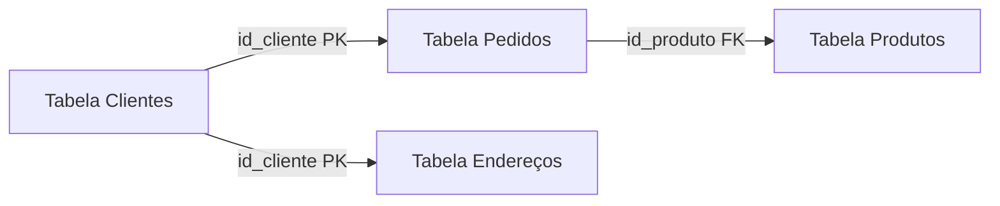

# 📚 Aula 2: Conceitos Fundamentais de Banco de Dados

## ✨ 2.1 Frase Reflexiva

> "Sem bancos de dados, a informação se torna caos. A organização dos dados é o primeiro passo para a inovação." — Autor Desconhecido

## 🏁 2.2 Introdução

Os bancos de dados são o **coração** de sistemas digitais modernos, permitindo que informações sejam armazenadas, organizadas e recuperadas de maneira eficiente. Desde redes sociais até sistemas bancários, os bancos de dados garantem que as aplicações funcionem de maneira confiável e segura.

Nesta aula, exploraremos os principais **conceitos estruturais de bancos de dados**, incluindo **tipos de dados, componentes de um banco relacional e criação de tabelas**. Além disso, daremos **os primeiros passos no MySQL**, aplicando os conceitos aprendidos.

------

## 🔍 2.3 Desenvolvimento do Conteúdo

### **📖 2.3.1 O que é um Banco de Dados?**

📌 **Definição:** Um banco de dados é uma coleção estruturada de informações, organizadas para facilitar **acesso, gerenciamento e atualização**.

📌 **Exemplo Prático:** Imagine uma biblioteca. Cada **prateleira** representa uma **tabela**, cada **livro** é um **registro** e cada **capítulo** é um **atributo**.

📌 **Objetivo:** Garantir armazenamento eficiente, seguro e de fácil recuperação dos dados.

------

### **🗄️ 2.3.2 Tipos de Dados em um Banco de Dados**

Os bancos de dados armazenam diferentes tipos de informações, e esses dados podem ser classificados em três categorias principais: **dados estruturados, não estruturados e semi-estruturados**. Vamos explorar cada um deles com detalhes.

#### 📊 **Dados Estruturados**

Os dados estruturados são organizados em **tabelas**, contendo **linhas e colunas**. Esse formato facilita consultas e manipulações através de linguagens como SQL.

📌 **Exemplo:**

```
CREATE TABLE clientes (
    id_cliente INT PRIMARY KEY,
    nome VARCHAR(50),
    email VARCHAR(50)
);
```

📌 **Explicação:** A tabela `clientes` contém três colunas: `id_cliente` (chave primária), `nome` e `email`.

#### 🖼️ **Dados Não Estruturados**

São dados sem um formato fixo ou predefinido, como imagens, vídeos, áudios e documentos de texto.

📌 **Exemplo:** Arquivo de imagem em um banco de dados:

```
CREATE TABLE fotos (
    id_foto INT PRIMARY KEY,
    descricao TEXT,
    imagem BLOB
);
```

📌 **Explicação:** A coluna `imagem` usa o tipo `BLOB`, adequado para armazenar imagens e outros arquivos binários.

#### 📜 **Dados Semi-Estruturados**

São dados parcialmente organizados, com alguma estrutura interna, mas sem um esquema rígido como o dos bancos relacionais. JSON e XML são exemplos comuns.

📌 **Exemplo:**

```
{
    "id": 1,
    "produto": "Notebook",
    "preco": 3500.00,
    "estoque": 10
}
```

📌 **Explicação:** Esse formato JSON é amplamente utilizado em APIs e bancos de dados NoSQL, permitindo flexibilidade na estrutura dos dados.

------

### **🏗️ 2.3.3 Componentes de um Banco Relacional**

Os bancos de dados relacionais são compostos por diversos elementos estruturais, cada um com sua função específica.

🔹 **Tabelas**: Estruturas que armazenam dados organizados em linhas e colunas.
🔹 **Linhas (Registros)**: Cada linha representa um **registro único** dentro da tabela.
🔹 **Colunas (Atributos)**: Cada coluna define um **atributo específico** do registro.
🔹 **Chave Primária**: Identifica **de forma única** cada registro na tabela.
🔹 **Chave Estrangeira**: Relaciona duas tabelas, garantindo a **integridade referencial**.
🔹 **Índices**: Melhoram a eficiência das consultas, tornando a recuperação de dados mais rápida.
🔹 **Relacionamentos**: Conectam tabelas para evitar redundância de dados e melhorar a organização.

📌 **Gráfico Representando um Banco de Dados Relacional:**



📌 **Código para Criar o Gráfico:**

```sql
-- Criando a tabela Clientes
CREATE TABLE clientes (
    id_cliente INT PRIMARY KEY,
    nome VARCHAR(100),
    email VARCHAR(100)
);

-- Criando a tabela Produtos
CREATE TABLE produtos (
    id_produto INT PRIMARY KEY,
    nome_produto VARCHAR(100),
    preco DECIMAL(10,2)
);

-- Criando a tabela Pedidos
CREATE TABLE pedidos (
    id_pedido INT PRIMARY KEY,
    id_cliente INT,
    id_produto INT,
    data_pedido DATE,
    quantidade INT,
    FOREIGN KEY (id_cliente) REFERENCES clientes(id_cliente),
    FOREIGN KEY (id_produto) REFERENCES produtos(id_produto)
);

-- Criando a tabela Endereços
CREATE TABLE enderecos (
    id_endereco INT PRIMARY KEY,
    id_cliente INT,
    rua VARCHAR(150),
    cidade VARCHAR(100),
    estado VARCHAR(50),
    cep VARCHAR(15),
    FOREIGN KEY (id_cliente) REFERENCES clientes(id_cliente)
);
```

- ### ✅ **Explicação do Código**

  1. **Tabela `clientes`**:
     - Armazena os clientes e tem `id_cliente` como **chave primária (PK)**.
  2. **Tabela `produtos`**:
     - Contém os produtos disponíveis, com `id_produto` como **chave primária (PK)**.
  3. **Tabela `pedidos`**:
     - Registra as compras dos clientes e se relaciona com:
       - `clientes` através da **chave estrangeira (FK) `id_cliente`**.
       - `produtos` através da **chave estrangeira (FK) `id_produto`**.
  4. **Tabela `enderecos`**:
     - Armazena os endereços dos clientes, referenciando `clientes(id_cliente)` como **chave estrangeira (FK)**.

  Esse código garante um **banco de dados relacional organizado**, seguindo as **boas práticas de modelagem SQL**. 🚀📊

---

## 🎯 2.4 Atividades Práticas

### **📌 2.4.1 Em Sala de Aula**

1. Criar uma tabela `clientes` no MySQL e inserir registros.
2. Identificar dados estruturados e não estruturados em aplicativos comuns.

### **🏡 2.4.2 Para Casa**

1. Criar uma tabela `produtos` no MySQL e inserir dados fictícios.
2. Pesquisar a importância de chaves primárias em bancos relacionais.

------

## 📌 2.5 Fixação do Conteúdo

### **🖊️ Questões Dissertativas**

1. Explique a diferença entre tabelas, linhas e colunas.
2. Por que chaves primárias são essenciais para a integridade dos dados?

### **📝 Questões de Múltipla Escolha**

1. Qual a definição correta de uma chave primária?
   - [ ] Aceita valores duplicados.
   - [ ] Identifica cada registro de forma única.
   - [ ] É opcional em tabelas relacionais.
   - [ ] Apenas armazena dados textuais.
2. Qual dos seguintes é um dado estruturado?
   - [ ] Vídeo do YouTube.
   - [ ] Planilha do Excel.
   - [ ] Arquivo JSON.
   - [ ] Áudio gravado.

### **📋 Questões de Caixa de Seleção**

1. Quais são componentes de um banco de dados relacional?
   - [ ] Tabelas
   - [ ] Chaves Estrangeiras
   - [ ] Índices
   - [ ] Streaming de Vídeo
   - [ ] Colunas
   - [ ] Relacionamentos
   - [ ] JSON
2. Quais são vantagens do armazenamento em nuvem?
   - [ ] Backup Automático
   - [ ] Acesso Remoto
   - [ ] Independência de Internet
   - [ ] Maior Segurança Contra Falhas Físicas
   - [ ] Flexibilidade na Escala de Armazenamento
   - [ ] Risco Zero de Perda de Dados
   - [ ] Menor Consumo de Rede

### **🔗 Questões de Associação de Colunas**

1. **Tabela** ➝ ( ) Estrutura que armazena dados organizados.
2. **Chave Primária** ➝ ( ) Identificador único de um registro.
3. **Chave Estrangeira** ➝ ( ) Relaciona duas tabelas.
4. **Linha** ➝ ( ) Representa um único registro.
5. **Índices** ➝ ( ) Estruturas que otimizam a velocidade de pesquisa nos dados.
6. **Relacionamento** ➝ ( ) Conexão entre tabelas para evitar redundância.

### **⚖️ Questões de Verdadeiro ou Falso**

1. Dados não estruturados podem ser facilmente organizados em tabelas.
2. Chaves primárias permitem registros duplicados na mesma tabela.
3. JSON é um formato de dados semi-estruturado.
4. SQL é uma linguagem usada para manipulação de bancos de dados relacionais.

- [ ] F V V V
- [ ] V F V V
- [ ] V F F V
- [ ] V F V F

------

## 🏁 2.6 Conclusão

Nesta aula, aprendemos os conceitos fundamentais de bancos de dados, exploramos os diferentes **tipos de dados**, entendemos os **componentes de um banco relacional** e praticamos a **criação de tabelas no MySQL**.

📌 **Na próxima aula, avançaremos para manipulação de dados, explorando comandos SQL essenciais!** 🚀
